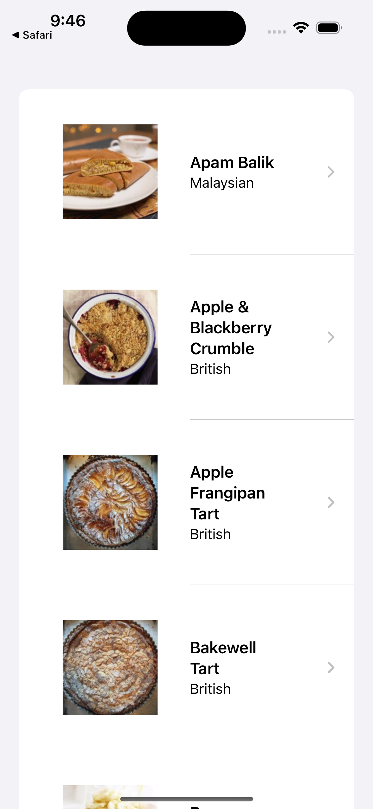
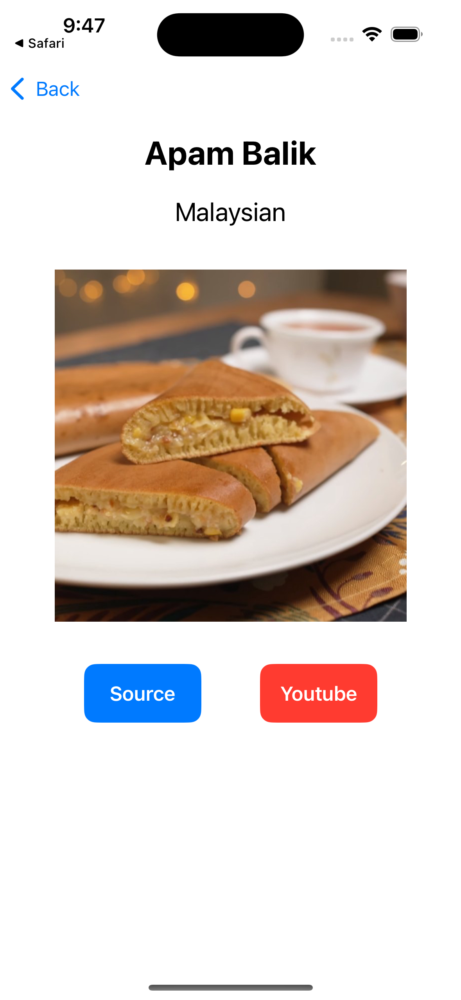

### Summary: Include screen shots or a video of your app highlighting its features

Screenshots

The app's homescreen displays all its recipes in a list, each cell displays an image fetched using photo_url_small url from the network or the cache on the left, and the dish's name and cuisine type on the right. The list supports the pull-down-to-refresh feature as well.

Upon tapping one of the recipes on the homescreen, the user is led to the details screen. The details screen displays the dish's name, cuisine, a photo fetched with the photo_url_large url from the network or the cache, and buttons to redirect the user to the recipe's source or YouTube video.

In case the data received contains a malformed JSON response, the app will throw an alert informing the user of the relevant error and a button to refresh.

In the scenario where there are no recipes, the app will display a relevant message to inform to user that no recipes are available.

This is a quick video demonstration of the app. This video demonstrates the caching capabilities developed. The small and large images used in the list view and details view respectively are fetched from the network if not cached. Images in the cache are fetched the next time they are required, loading instantly and avoid unncesscary network calls.

### Focus Areas: What specific areas of the project did you prioritize? Why did you choose to focus on these areas?

I prioritized the network and image caching components of the application. I believe establishing functionality that meets the requirements with good performance is key before developing other aspects of the app.

### Time Spent: Approximately how long did you spend working on this project? How did you allocate your time?

I spent six to seven hours completing the project. Due to time constraints from traveling, I allocated an hour a day to developing the app.

### Trade-offs and Decisions: Did you make any significant trade-offs in your approach?

Due to time constraints and focus mainly spent on the network, caching, and unit testing, I decided to implement a simpler user interface.

### Weakest Part of the Project: What do you think is the weakest part of your project?

I believe the weakest part of my project would be the user interface. Had I the time to continue further development on the app, I would utilize SwiftUI's many capabilities to create a more welcoming user interface.

### Additional Information: Is there anything else we should know? Feel free to share any insights or constraints you encountered.

When writing the unit tests for the app, I've encountered some issues when implementing the unit tests with Swift's new Testing framework due to unfamiliarity. From first impressions the framework seems to introduce a cleaner look to writing unit tests and I will begin to implement tests with this new framework from now on.